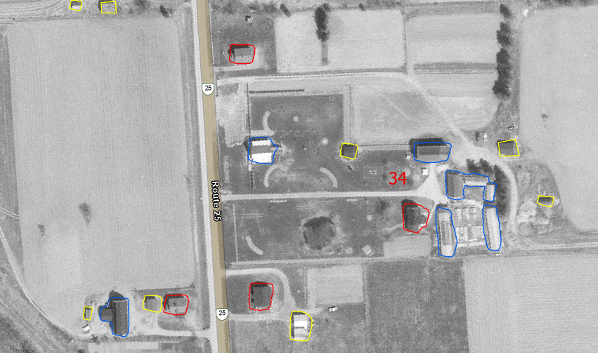
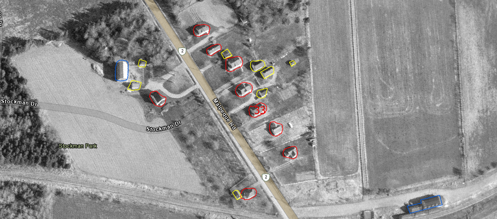

# Deep Learning for Geospatial Analysis: Automating Building Recognition Across Prince Edward Island (1968)

## Project Objective
This project aimed to achieve clear segmentation and mapping of historic buildings (barns, houses, and other structures such as garages, sheds, and work stations) using historical aerial imagery of Prince Edward Island from 1968. This process opens up wide opportunities for analysis, exploring various metrics and statistics that align with regional phenomena.

## Initial Challenges
1.  **Data Complexity:** Dealing with a massive, black-and-white historical map required specialized handling and custom dataset creation.
2.  **Iterative Model Scaling:** An initial stage of the project utilized the internal Deep Learning toolset in ArcGIS, deploying Mask R-CNN (ResNet-50) trained with ~1,200 samples. This iteration successfully produced polygon shapes for each class across the whole island, morphing the workflow from manual creation to manual correction and saving months of work. However, the team concluded that a subsequent iteration of the same model with more training data would yield better results in generating and categorizing these polygons.
3.  **Computational Limitations:** The deep learning capabilities built into ArcGIS could no longer be applied as before. Our hardware wasn't powerful enough to process the scale-up from ~1,200 to ~14,000 training samples, necessitating an external deep learning solution.

## Technical Journey and Methodology

### 1. Data Preparation and Custom Dataset Development
*   **Manual Segmentation:** Approximately 14,000 building entries were manually segmented across Prince County, forming the basis of the training data.
*   **PyTorch Dataset Implementation:** A robust `HistoricBuildingDataset` was developed using PyTorch. This custom data loader was designed to:
    *   Handle complex `.tif` image formats and their associated instance segmentation masks.
    *   Perform dynamic image and mask loading, including processing of instance segmentation masks.
    *   Enable efficient batching for model training.

### 2. Model Selection and Architecture
*   **Mask R-CNN:** A pre-trained `Mask R-CNN` model, equipped with a ResNet-50-FPN backbone, was selected and fine-tuned for the task. This architecture was chosen for its proven capability in high-accuracy object detection and instance segmentation across various object classes.

```
def get_model(num_classes):
    model = torchvision.models.detection.maskrcnn_resnet50_fpn(weights="DEFAULT")

    # Replace bounding box head
    in_features = model.roi_heads.box_predictor.cls_score.in_features
    model.roi_heads.box_predictor = FastRCNNPredictor(in_features, num_classes)

    # Replace mask head
    in_features_mask = model.roi_heads.mask_predictor.conv5_mask.in_channels
    hidden_layer = 256
    model.roi_heads.mask_predictor = MaskRCNNPredictor(in_features_mask, hidden_layer, num_classes)

    return model

# Send model to the Colab GPU
device = torch.device('cuda') if torch.cuda.is_available() else torch.device('cpu')
model = get_model(num_classes=4)
model.to(device)

# Setup the optimizer (how the model learns from mistakes)
params = [p for p in model.parameters() if p.requires_grad]
optimizer = torch.optim.SGD(params, lr=0.005, momentum=0.9, weight_decay=0.0005)

print(f"Model built and loaded onto: {device}")
```

### 3. Model Training

*   **Environment:** Trained on Google Colab leveraging an NVIDIA T4 GPU for hardware acceleration.
*   **Dataset Scale:** 6,044 image tiles containing ~14,000 distinct building segmentations.
*   **Training Performance:** Achieved a final validation loss of ~0.31.

**Quantitative Metrics (10% Hold-out Set):**
*   **mAP (IoU=0.50:0.95):** 0.3805
*   **mAP@50 (IoU=0.50):** 0.6690
*   **mAP@75 (IoU=0.75):** 0.4049

*Explanation of Evaluation Metrics:*
*   **mAP (Mean Average Precision):** The standard metric for instance segmentation. It calculates how accurately the model detects an object and how perfectly its predicted polygon matches the true building footprint across various strictness levels.
*   **mAP@50 (Loose Overlap):** Measures accuracy when the model's prediction only needs to overlap the actual building by 50% (Intersection over Union). A score of 0.6690 indicates strong reliability in finding buildings and identifying their general locations.
*   **mAP@75 (Strict Overlap):** Measures accuracy when requiring a strict 75% overlap. The drop to 0.4049 highlights the model's difficulty in generating pixel-perfect boundaries, a direct consequence of the variable contrast, shadows, and film grain inherent in 1968 black-and-white aerial imagery.

**Hyperparameters**
*   **Optimizer:** Stochastic Gradient Descent (SGD)
*   **Learning Rate:** 0.005
*   **Momentum:** 0.9
*   **Weight Decay:** 0.0005
*   **Epochs:** 10
*   **Batch Size:** 4

### 4. Memory-Efficient Geospatial Inference Pipeline

To process hundreds of thousands of high-resolution `.tif` files across entire counties, a specialized memory-efficient pipeline was developed using `rasterio`:

*   **Intelligent Tiling (256x256):** Massive county-level TIFF files were sliced into 256x256 pixel spatial chips. A 20% overlap strategy (calculated via a 204-pixel stride) was implemented to ensure continuous coverage and prevent structures from being severed at tile edges.
*   **Multi-Stage Algorithmic Filtering:** To optimize processing time and eliminate empty geography, a stringent 3-pass filter evaluated each window before saving:
    *   **NoData Check:** Discarded tiles where less than 5% of the total pixels contained readable data.
    *   **Black Cluster Threshold:** Discarded tiles containing >25% pure black pixels, effectively eliminating map borders and deep ocean segments.
    *   **Variance Filter:** Discarded tiles with a standard deviation below 16.3, successfully filtering out visually uniform areas lacking structural features (e.g., open water, flat agricultural fields).
*   **Geospatial Preservation:** The `rasterio.windows.Window` transform was dynamically applied to preserve the exact real-world CRS coordinates for every generated sub-tile.
*   **I/O Optimization:** To bypass Google Drive network bottlenecks during the generation of tens of thousands of files, tiles were written to a local temporary Colab directory, bulk-compressed into a `.zip` archive, and then exported in a single transfer.

### 5. GeoJSON Conversion and Spatial Intelligence
*   **Output Format:** The model's pixel-level predictions were converted into the industry-standard `GeoJSON` format, crucial for integration with ArcGIS.
*   **Coordinate Transformation:** Pixel coordinates from the `.tif` images were accurately transformed to WGS84 (latitude/longitude), ensuring global compatibility.
*   **Area Calculation:** The real-world area of detected buildings was precisely calculated in square meters using the original Coordinate Reference System (CRS) and embedded into the GeoJSON properties.

### 6. Advanced Duplicate Handling
To address the issue of multiple overlapping polygons generated for a single building due to tiled inference, a multi-stage duplicate handling approach was implemented.

**Refined GeoPandas Dissolve/Explode: A more robust method using GeoPandas was developed, involving:**

* Micro-Buffering: Expanding polygons by 0.5 meters to bridge microscopic gaps between tiles.

* Same-Class Dissolve: Merging touching polygons of the same building class into single, cohesive geometries.

* Explode: Breaking down merged multipolygons back into individual, distinct building shapes.

* Restore Original Dimensions: Shrinking polygons by 0.5 meters to revert to their true ground size.

* Cross-Class Overlap Filtering: A final filter removes cross-class overlaps. If two or more polygons (even of different classes) overlap by a 30% threshold, the detection with the highest confidence score is retained, drastically reducing redundant shapes.

### 7. Limitations and Edge Cases

While the model demonstrated high accuracy in rural segmentation, evaluating its performance revealed specific boundary conditions and limitations. These errors are primarily attributed to training data distribution, spectral constraints, and environmental variance.

*   **Training Distribution Bias (Rural vs. Urban):** The dataset was heavily biased toward rural agricultural landscapes. Consequently, the model struggled in unrepresented domains:
    *   **Cottage Zones:** High-density, smaller footprint cottages were frequently misclassified as secondary outbuildings.
    *   **Urban Centers:** Square commercial structures and closely packed town buildings were often ignored or misclassified.
*   **Geometric Conflation:** Coastal infrastructure, specifically docks, produced false positives as their top-down rectangular footprints closely mimic agricultural barns. Additionally, isolated tree canopies occasionally triggered false positive detections.
*   **Spectral & Temporal Variance:** 
    *   **Panchromatic Limitations:** The inherent lack of multispectral data in the 1968 black-and-white imagery caused distinct structures with similar geometric and spectral signatures (e.g., a longhouse vs. a barn) to be confused.
    *   **Environmental Factors:** Varying flight angles and times of day introduced inconsistent shadows and lighting, altering the perceived shape and contrast of structures across different tiles.

**Impact on Workflow**
Although exact time-saving metrics were not recorded, deploying the inference pipeline fundamentally accelerated the mapping phase. By shifting the workload from ground-up manual polygon digitization to a streamlined process of geometric verification and correction, the model considerably reduced the timeline required to achieve full-island coverage.

## Final Review and Project Outcome
*   **ArcGIS Integration:** The generated GeoJSON files were imported back into ArcGIS for manual correction, inspection, and further analysis.
*   **Workflow Value:** This project demonstrates a powerful workflow for automating the creation of valuable geospatial datasets from historical aerial imagery.
*   **Historical Insights:** The generated dataset will be instrumental in uncovering historical insights into Prince Edward Island from 1968, including identifying housing clusters, land distribution patterns, and understanding the broader geographical state of the island.

## Final result example implemented into ArcGIS






## Data Analysis

**Methodology & Metric Selection**
The primary objective of the analysis phase was to quantify the 1986 historical landscape. The core metrics focused on building density and average footprint area (m²) aggregated by lot and county. 

The following convention was established for spatial analysis:
* **`House_N`:** Total number of houses per lot
* **`House_AveM2`:** Average house footprint (m²) per lot
* **`Barn_N`:** Total number of barns per lot
* **`Barn_AveM2`:** Average barn footprint (m²) per lot
* **`Out_N`:** Total number of outbuildings per lot
* **`Out_AveM2`:** Average outbuilding footprint (m²) per lot

**Key Findings & Spatial Phenomena**
* **Density Hotspots:** Mapping these metrics revealed distinct spatial concentrations, notably highlighting the "potato belt" with a high density of farms and residential structures in the central region of the island.
* **Building sizes and city limits:** Analysis of building size distributions showed that the largest structures correlate with active agricultural commerce and proximity to commercial areas like Charlottetown and Summerside. Average residential footprints shrink as distance from these centers increases.
* **Barn-to-House Ratio:** Evaluating this ratio identified primary agricultural reserves per lot, correlating strongly with known historical locations of livestock, root crop, and berry farming operations among many others. 

**Full Results:** [[1968_Comprehensive_Building_Report]](1968_Comprehensive_Building_Report.pdf) 

## Technologies Utilized
Key open-source libraries critical to this project include PyTorch, torchvision, rasterio, shapely, geojson, geopandas, and numpy.
